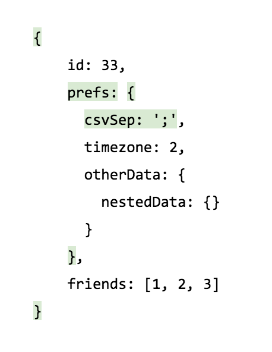

immutable update utils for JS `Object` and `Arrays`.

This library only does simple updates (e.g setting, modifying or deleting a value), for more powerful combinators, see [space-lift](https://github.com/AlexGalays/spacelift) which also fully includes `immupdate`.


* [But why](#intro)
* [How to use](#howtouse)
* Examples
  * [Update multiple properties shallowly](#update-multiple-properties)
  * [Update a nested property](#update-nested-property)
  * [Update an Array item](#update-array-item)
  * [Update a nested property using its current value](#update-nested-property-modify)
  * [Update a nested property on a nullable path](#update-nested-nullable-property)
  * [Update a nested union property](#update-nested-union-property)
  * [Update a space-lift Option](#update-option)


<a name="intro"></a>

# Why not just recursively deep clone defensively
* It's very wasteful and can often be too slow for nested structures.
immupdate updates the paths that truly changed and only at update time, not defensively everytime an object is handed out in fear it might be mutated in place.
* If everything gets a new reference, we can't know what changed between two operations.  

# Why not use Object spreads
* First, it's terrible for nested updates.
* it's also pretty bad for shallow updates as it doesn't have the strict semantic of an update operation but rather, the semantic of more generally extending the base object. So while it is technically possible to use it, it's a bad idea and is very unsafe, especially during refactorings. The very least you should expect from a type system is to be able to catch typos.
Example:
```ts
const john = {name: 'john', address: '17, claproast st'};
const updatedJohn = {...john, adress: '18, claproast st'}; // oh no
```

# Why Object/Array instead of immutable data structures

Pros:

- This lib is tiny and only manipulate JS' native data structures. Immutable data structures with a rich API will usually come packaged as a fairly big library.
- No need for encoding/decoding when the server sends JSON data structures. With immutable data structures, they must first be converted into deeply nested data structures.
- The client sends back JSON to the server: the deeply nested data structures must be converted back to JSON.
- Many rendering libraries (mithril, virtual-dom, d3, knockout, etc) expect native Arrays to render a list of DOM nodes. This means our shiny data structure must be converted back to an Array **every time** a re-render is necessary.
- Persisting to localStorage is often done via JSON.stringify() for convenience, this is trivial when we are this close to the metal.
- Popular third party libraries work with plain Objects or Arrays; This might change in a few years when JS has higher level abstractions like iterators available in mainstream browsers and libraries make use of it instead of having a hard dependency on Arrays (or with new languages directly compiling to byte code).
- Ironically, standard Objects and Arrays are heavily optimized by the JS engines and are often faster and use less memory compared to immutable collections using structural sharing.
- Any utility functions you may have written for Arrays/Objects will always be portable. Utils for the popular immutable lib of the month will not.

Cons:

- Immutability can NOT be enforced at compile time as the underlying JS structures are still mutable.  
Coding conventions and discipline is more important than with well designed immutable data structures.


<a name="howtouse"></a>
# How to use

Here's everything that can be imported from `immupdate`:  

```ts
import { update, deepUpdate, DELETE } from 'immupdate'
```

`update` updates the shallow properties of an object  
`deepUpdate` can update one arbitrarily nested property in a JSON tree  
`DELETE` is a special marker used with `update` and `immupdate` to delete a property  

# Examples

<a name="update-multiple-properties"></a>
## Update multiple properties

```ts
import { update, DELETE } from 'immupdate'

type Person = { id: number, name: string, tatoo?: string }

const jose: Person = {
  id: 33,
  name: 'Jose',
  tatoo: '自由'
}

const carla = update(jose, {
  name: 'Carla',
  tatoo: DELETE
})
```

The differences with `Object.assign` or the `{ ...source }` notation is that you can delete a property and `update()` is typesafe: You can't make a typo, add completely new keys, etc.


<a name="update-nested-property"></a>
## Update a nested property

Two ways to do it:

1) `update` performs shallow updates, so we will just have to call it multiple times.

```ts
import { update } from 'immupdate'

interface Person {
  id: string
  prefs: {
    csvSep: ',' | ';'
    timezone: number
    otherData?: {
      nestedData: {}
    }
  },
  friends: number[]
}

const person = {
  id: 33,
  prefs: {
    csvSep: ',',
    timezone: 2,
    otherData: {
      nestedData: {}
    }
  },
  friends: [1, 2, 3]
}

const newPrefs = update(person.prefs, { csvSep: ';' })

const personWithNewPrefs = update(person, { prefs: newPrefs })
```

2) but this can get tedious pretty fast, especially once we reach 3 levels of nesting or more. `deepUpdate` to the rescue:  

```ts
import { deepUpdate } from 'immupdate'

const personWithNewPrefs = deepUpdate(person)
  .at('prefs')
  .at('csvSep')
  .set(';')
```

This is fonctionally equivalent to the code using multiple `update` calls.  


`person` was only updated where necessary. Below in green are the paths that were updated. This is much more efficient than deep cloning.  



<a name="update-array-item"></a>
## Update an Array item

Two choices:  

1) Using `update` which doesn't specifically deal with Arrays, so we want to prepare the updated Array instance beforehand.  

```ts
import { update } from 'immupdate'

const person = {
  friends: [
    { id: 1, name: 'biloute' },
    { id: 2, name: 'roberto' },
    { id: 3, name: 'jesus' }
  ]
}

const newFriends = person.friends.map(f => f.id === 3 ? update(f, { name: 'rocky' }) : f)

const newPerson = update(person, { friends: newFriends })
```

2) Using `deepUpdate`:  

```ts
import { deepUpdate } from 'immupdate'

const newPerson = deepUpdate(person)
  .at('friends')
  .at(person.friends.findIndex(f => f.id === 3))
  .abortIfUndef()
  .at('name')
  .set('rocky')
```


<a name="update-nested-property-modify"></a>
## Modify a nested property using its current value

```ts
import { deepUpdate } from 'immupdate'

const person = {
  friends: [
    { id: 1, name: 'biloute' },
    { id: 2, name: 'roberto' },
    { id: 3, name: 'jesus' }
  ]
}

const newPerson = deepUpdate(person)
  .at('friends')
  .at(person.friends.findIndex(f => f.id === 3))
  .abortIfUndef()
  .at('name')
  .modify(name => `MC ${name}`)
```


<a name="update-nested-nullable-property"></a>
## Update a nested property on a nullable path

If there is a nullable key (or An array index being used) anywhere in the update path and it's not the last key (i.e, right before `modify` or `set`)  
then it's a potentially unsafe operation and the library will ask you to decide what to do with it (it won't compile until you do).  

You can either:  

1) Abort the whole thing (the returned value is the same as the passed one)

```ts
import { deepUpdate } from 'immupdate'

interface Person {
  prefs?: {
    lang: string
  }
}

deepUpdate<Person>({})
  .at('prefs')
  .abortIfUndef()
  .at('lang')
  .set('en')
```

Or  

2) Specify a default value to be used if the current value is null/undefined  

```ts
import { deepUpdate } from 'immupdate'

interface Person {
  prefs?: {
    lang: string
  }
}

const defaultPrefs = { lang: 'en' }

deepUpdate<Person>({})
  .at('prefs')
  .withDefault(defaultPrefs)
  .at('lang')
  .set('en')
```

<a name="update-nested-union-property"></a>
## Update a nested union property

```ts
import { deepUpdate } from 'immupdate'

type A = { type: 'a', data: string }
type B = { type: 'b', data: number }
type Container = { aOrB: A | B }
const isA = (u: A | B): u is A => u.type === 'a'

const container = { aOrB: { type: 'a', data: 'aa' } }

deepUpdate(container)
  .at('aOrB')
  .abortIfNot(isA)
  .at('data')
  .set('bb')
```

<a name="update-option"></a>
## Update a space-lift Option

Additionally, if you're also using [space-lift](https://github.com/AlexGalays/spacelift), you can update Option values anywhere in a tree. Updating an `Option<T>` works exactly like updating a `T | undefined`, so you still have to explicitly tell `deepUpdate` what to do in case it encounters a `None`.  

```ts
const obj = {
  a: Some({
    b: Some({ c: 1 }),
    x: { y: 'y' }
  })
}

const result = deepUpdate(obj)
  .at('a')
  .abortIfUndef()
  .at('b')
  .withDefault({ c: 5 })
  .at('c')
  .set(10)
```
